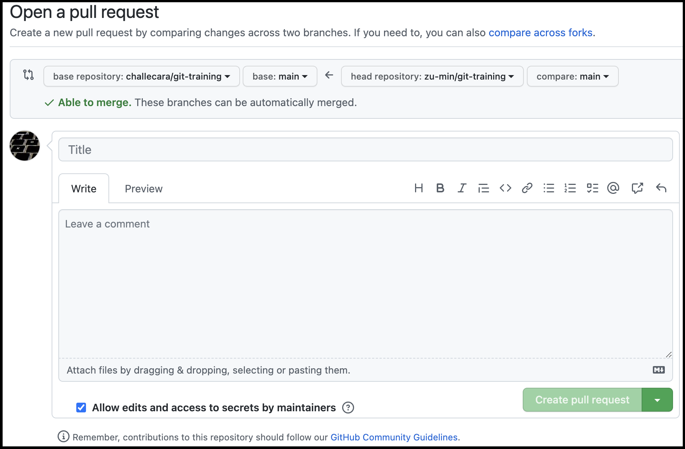
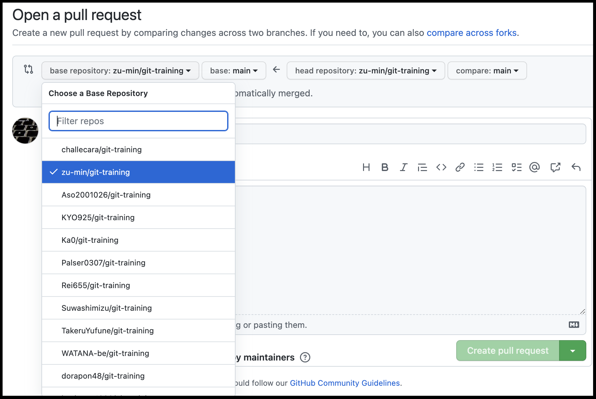

## プルリクエストを作成する

### 注意事項
今回は、フォークしたリポジトリでプルリクエストを作成しますが、フォーク元(challecara/git-training)にプルリクエストを作成するわけではないので、公式ドキュメント内の `フォークからプルリクエストを作成する` の項ではないことに注意してください。(フォーク元に対して、改善などのプルリクエストを送りたい場合に利用するものです)

以下は、PR作成時の宛先例です。今回の演習では `challecara/git-training` <span style="color: red; ">ではなく</span>、自身のGitHubアカウントのリポジトリや、チーム内代表者のリポジトリにプルリクエストを作成します。
この画像では、zu-minというGitHubユーザが、フォークした自身のリポジトリにプルリクエストを作成している例です。




### 作成方法
注意事項の内容に注意した上で、[GitHubの公式ドキュメント](https://docs.github.com/ja/pull-requests/collaborating-with-pull-requests/proposing-changes-to-your-work-with-pull-requests/creating-a-pull-request) を参考に、プルリクエストを作成しましょう。

タイトルは、何をしたのかがひと目で分かるように、本文には詳細を書くようにしましょう。

## プルリクエスト例
### タイトル例
```
`/challecara` エンドポイントを追加します
```

### 本文例
```
`/challecara` にGetリクエストをすると、 `Hello challecara!` と表示される機能を実装しました。

Webブラウザで、 `http://localhost:4567/challecara` にアクセスすると、動作確認ができます。
```
