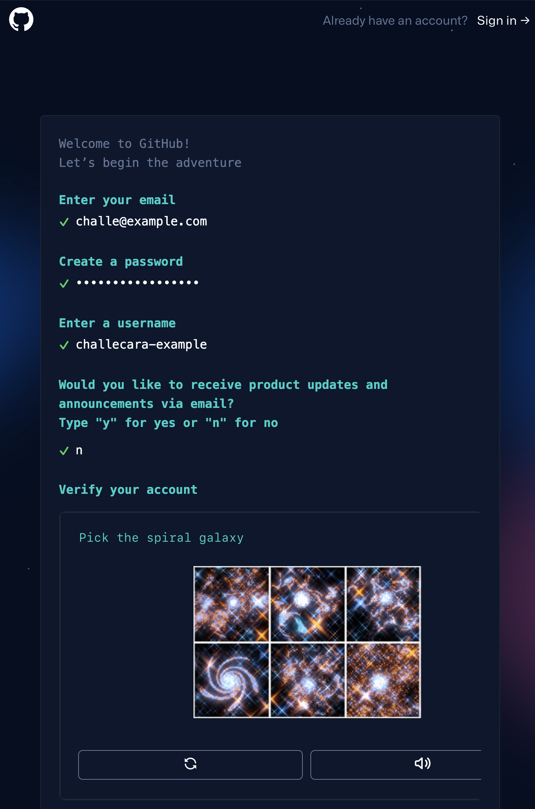

# GitHubの登録手順
スクリーンショットはこの手順作成時点のものなので、変わる可能性があります。

1. [GitHub](https://github.com/)にアクセスします
2. 右上の Sign up からアカウント作成を行います

3. 各種項目を入力していきます
  - メールアドレス
  - パスワード (パスワード強度によって色が変わります。強度の高いパスワードを設定しましょう。)
  - ユーザーネーム (これがGitHub IDになります)
  - 案内メール受信の有無を選択します (yを入力するとGitHubの新機能などの案内メールなどが来ます)
  - Start puzzle をクリックして、パズルを完成させます。2回やる必要があります。 (この画面では、spiral galaxyを選択しろとあるので、左下のやつです)
  - パズルが終わると出てくる Create account をクリックすると作成完了です

4. 作成したアカウントは、トップページの Sign in からユーザーネームとパスワードでログインできます。
