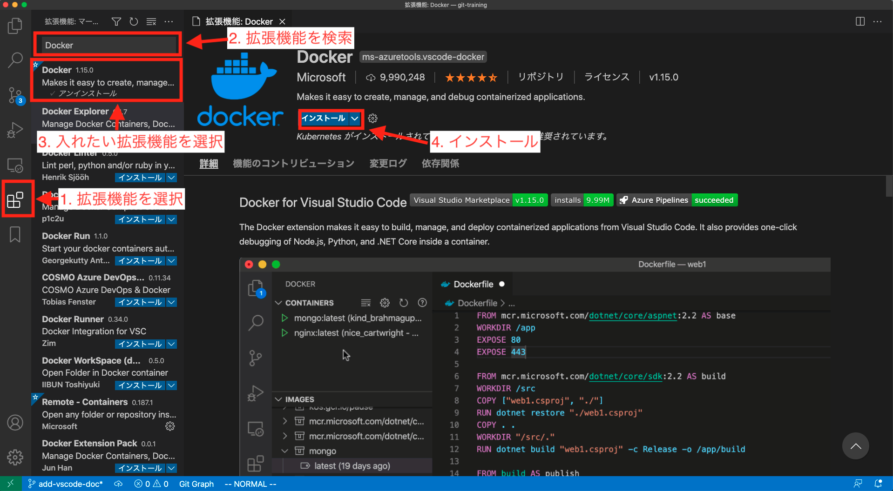

# Visual Studio Code（vscode）のセットアップ

## インストール
下記のURLよりご自身の環境に適したものをダウンロードしていただき、インストールを行ってください。

https://code.visualstudio.com/download

## プラグインのインストール
以下のプラグインをvscodeからインストールしてください。インストールしておくと便利かと思います。
他にも便利なプラグインがたくさんあるのでご自身の状況に合わせて調べてカスタマイズしていくと良いと思います。

- [Docker](https://marketplace.visualstudio.com/items?itemName=ms-azuretools.vscode-docker)
- [Git Graph](https://marketplace.visualstudio.com/items?itemName=mhutchie.git-graph)
- [Remote - WSL](https://marketplace.visualstudio.com/items?itemName=ms-vscode-remote.remote-wsl) （Windowsの方のみインストール）

### プラグインのインストール方法
下記の図のように、プラグイン名の検索を行いインストールを押すことで、簡単にプラグインのインストールができます。下図では、Dockerプラグインのインストール例を示しています。

