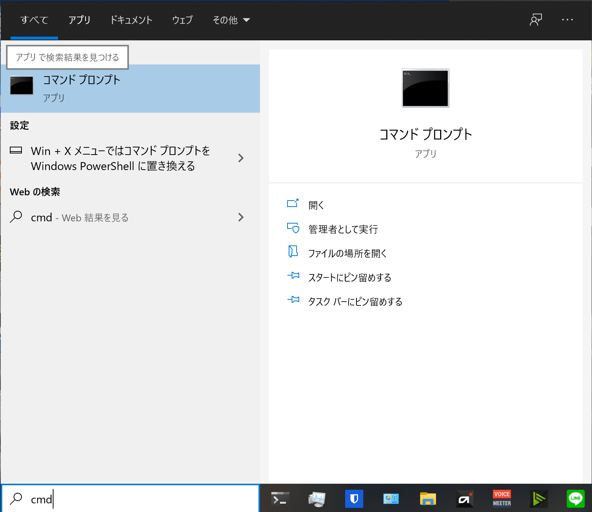
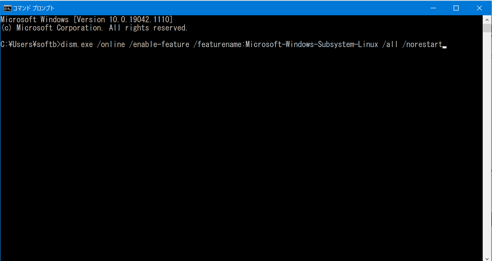
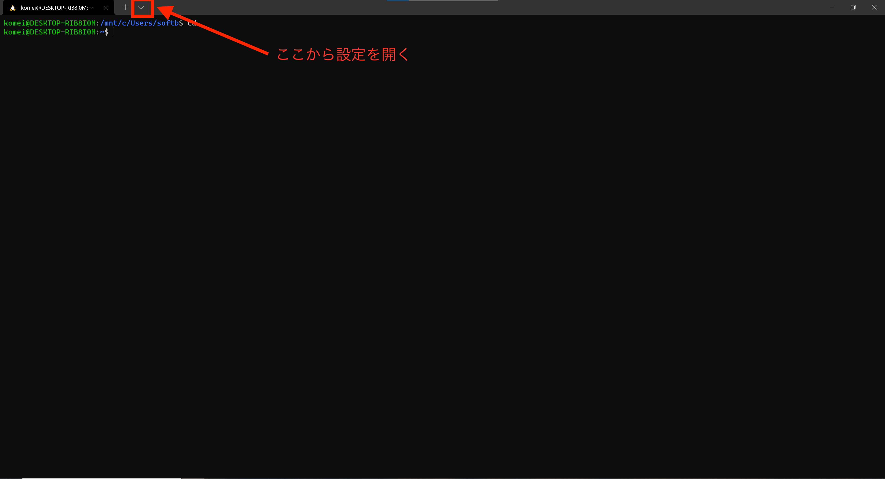

# WindowsのDocker環境構築手順
このドキュメントではWindowsでDockerが実行できる環境の構築手順を説明します。

## WSL2のインストール
WSL2はWindows上でLinuxを動作させるための仕組みのことです。
WSL2のインストールについては、[Microsft公式のWSLインストール手順](https://docs.microsoft.com/ja-jp/windows/wsl/install-win10#manual-installation-steps)が公開されており、こちらの手順に従ってインストールを行ってください。

手順を実行する上での注意点があります。まず、一部（手順1- Linux 用 Windows サブシステムを有効にするなど）PowerShellで実行するコマンドがあります。コマンドプロンプトを管理者権限で起動して、手順にあるコマンドを実行してください。
以下のように、コマンドプロンプトを検索して管理者として実行し、コマンドをコピペしてエンターで実行できます。






次の注意点として、「手順6-選択した Linux ディストリビューションをインストールするがありますが」、ここでは[Ubuntu 20.04 LTS](https://www.microsoft.com/store/apps/9n6svws3rx71)をインストールしてください。手順6にも記載がありますが、ユーザとパスワードを初回起動時に設定してください。Ubuntuの起動は、コマンドプロンプトと同様にWindows左下の検索バーに「Ubuntu」と検索することで出てきます。

以上の手順が正常に完了すると、WSL2（Windows Subsystem for Linux 2）が利用できるようになります。

### Windowsターミナルについて
[Windows ターミナルをインストールする (省略可能)](https://docs.microsoft.com/ja-jp/windows/wsl/install-win10#install-windows-terminal-optional)という項目がありますが、こちらもやっておくことを推奨します。Windowsターミナルは強制ではありませんが、以下の説明はWindowsターミナルをベースにして解説していきます。

また、Windowsターミナルの設定として、以下のようにUbuntuをデフォルトで起動するようにしておくと良いでしょう。




これによって、次回のWindowsターミナル起動時から自動的にUbuntu20.04が起動するようになります。

## Dockerのインストールと確認
### インストール方法
[こちらのリンク](https://hub.docker.com/editions/community/docker-ce-desktop-windows/)からDockerのインストーラを取得して実行し、指示に従ってください。インストールについてはこれで完了になります。

### 確認方法
Dockerが正常にインストールされたかを確認する方法を説明します。

Windowsターミナルを開いて、以下のようにコマンドを実行してください。同じような表示が出れば正常にインストールされています。

#### 確認コマンド1


#### 確認コマンド2


#### 確認コマンド3


#### 文字列で見たい方向け

<details>
<summary>dockerコマンドの確認</summary>
``` .sh
# コマンド1
$ docker version
Client: Docker Engine - Community
 Cloud integration: 1.0.17
 Version:           20.10.7
 API version:       1.41
 Go version:        go1.13.15
 Git commit:        f0df350
 Built:             Wed Jun  2 11:56:47 2021
 OS/Arch:           linux/amd64
 Context:           default
 Experimental:      true
 Server: Docker Engine - Community
 Engine:
  Version:          20.10.7
  API version:      1.41 (minimum version 1.12)
  Go version:       go1.13.15
  Git commit:       b0f5bc3
  Built:            Wed Jun  2 11:54:58 2021
  OS/Arch:          linux/amd64
  Experimental:     false
 containerd:
  Version:          1.4.6
  GitCommit:        d71fcd7d8303cbf684402823e425e9dd2e99285d
 runc:
  Version:          1.0.0-rc95
  GitCommit:        b9ee9c6314599f1b4a7f497e1f1f856fe433d3b7
 docker-init:
  Version:          0.19.0
  GitCommit:        de40ad0
```
</details>

<details>
<summary>docker-composeコマンドの確認</summary>
``` .sh
# コマンド2
$ docker-compose version
docker-compose version 1.29.2, build 5becea4c
docker-py version: 5.0.0
CPython version: 3.7.10
OpenSSL version: OpenSSL 1.1.0l  10 Sep 2019
```
</details>

<details>
<summary>コンテナが実行できるかの確認</summary>
``` .sh
# コマンド3
$ docker run hello-world
Hello from Docker!
This message shows that your installation appears to be working correctly.
To generate this message, Docker took the following steps:
 1. The Docker client contacted the Docker daemon.
 2. The Docker daemon pulled the "hello-world" image from the Docker Hub.
    (amd64)
 3. The Docker daemon created a new container from that image which runs the
    executable that produces the output you are currently reading.
 4. The Docker daemon streamed that output to the Docker client, which sent it
    to your terminal.
To try something more ambitious, you can run an Ubuntu container with:
 $ docker run -it ubuntu bash
Share images, automate workflows, and more with a free Docker ID:
 https://hub.docker.com/
For more examples and ideas, visit:
 https://docs.docker.com/get-started/
```
</details>

## 参考
- https://docs.microsoft.com/ja-jp/windows/wsl/install-win10#manual-installation-steps
- https://hub.docker.com/editions/community/docker-ce-desktop-windows/
